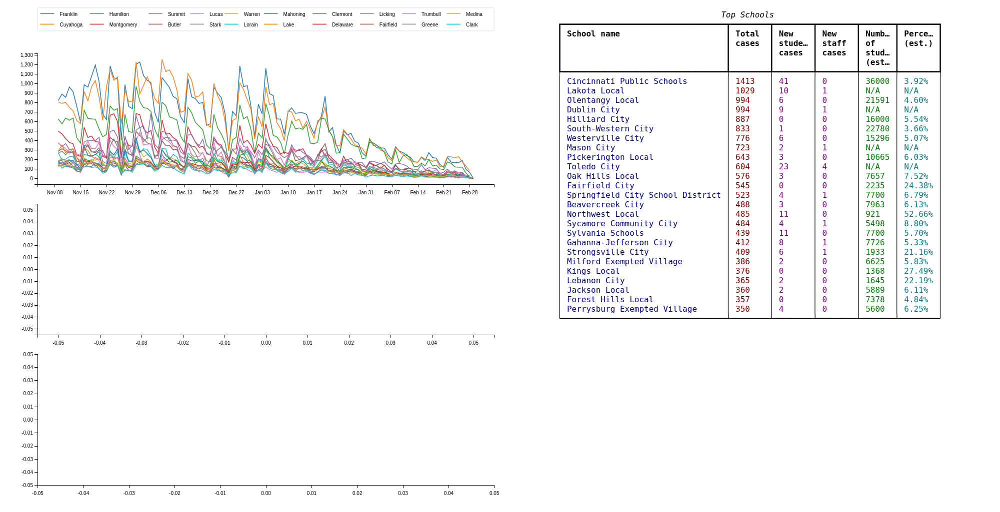

# Ohio Covid-19 data
Graphs Ohio Covid-19 data.

Automatically updated every three hours.



## View the data
- [Covid-19 cases by county](https://chriswmartin.github.io/ohio-covid19/)
- [Schools with the largest number of cases](https://chriswmartin.github.io/ohio-covid19/schools/index.html)

## Running locally
### Graphs

``` shell
git clone https://github.com/chriswmartin/ohio-covid19.git
cd ohio-covid19
pip3 install -r requirements.txt
python3 ohio-covid19.py
```
An `index.html` file will be saved to the project's root directory.

You might also like to edit `NUMBER_OF_COUNTIES` to change the number of counties displayed in each graph and the `time_ranges` list to add additional graphs at different timescales.

### Schools

``` shell
git clone https://github.com/chriswmartin/ohio-covid19.git
cd ohio-covid19/schools
pip3 install -r requirements.txt
python3 schools.py
```

An `index.html` file will be saved to the `ohio-covid19/schools` directory.

You can edit `NUMBER_OF_SCHOOLS` to add or remove schools from the generated table.
